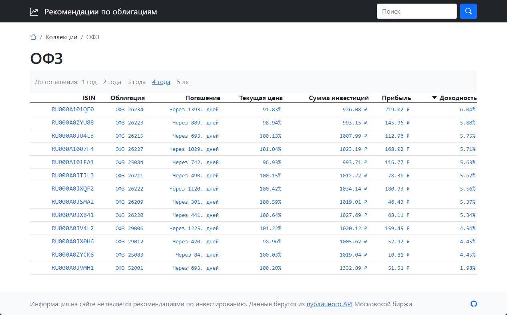

# moex-bond-recommender

Сервис для рекомендаций по покупке облигаций на базе [публичного API](https://iss.moex.com/) Московской биржи.



Сервис моделирует только один сценарий:

* Покупка облигации по текущей цене и удержание позиции до ее погашения.

  Рассчитывается сумма инвестиций, сумма выплат к моменту погашения, НДФЛ, прибыль/убыток и приведенная доходность к моменту погашения.

## Важно

Сервис является не более чем вспомогательным инструментом для инвестора.
Нет гарантии, что результаты расчета являются хоть сколько-нибудь корректными.
Все полученные данные нужно перепроверять иными средствами.

## Запуск

1. Создайте файл `.env` с необходимымим переменными окружения.
2. Выполните команду для сборки и запуска:

   ```shell
   docker-compose up -d --build
   ```

Сервис будет доступен по адресу `http://localhost:5000`.

## Лицензия

[MIT](LICENSE)
